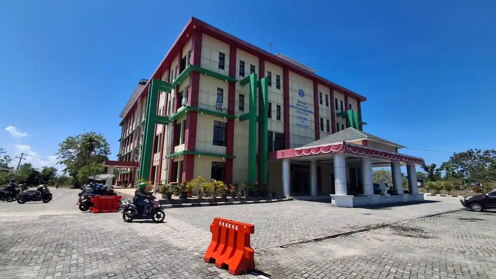

# Kumpulan Kode SIPERKA UBT

## `index.html`

```html
<!DOCTYPE html>
<html lang="id">
<head>
<meta charset="utf-8">
<meta name="viewport" content="width=device-width, initial-scale=1">
<meta name="description" content="Sistem Pelaporan Kerusakan Fasilitas Kampus Universitas Borneo Tarakan untuk mendukung pemeliharaan sarana dan prasarana akademik.">
<title>SIPERKA - Sistem Pelaporan Kerusakan Kampus</title>
<link rel="preconnect" href="https://fonts.googleapis.com">
<link rel="preconnect" href="https://fonts.gstatic.com" crossorigin>
<link href="https://fonts.googleapis.com/css2?family=Poppins:wght@300;400;500;600;700;800&display=swap" rel="stylesheet">
<link rel="stylesheet" href="styles.css">
<script type="module" src="js/app.js"></script>
</head>
<body>

<a href="#konten-utama" class="skip-link">Lewati ke konten utama</a>

<header class="site-header">
    <div class="container header-container">
    <div class="header-brand">
        
        <div class="brand-text">
            <h1>SIPERKA UBT</h1>
            <p class="tagline">Sistem Pelaporan Kerusakan Fasilitas Kampus Universitas Borneo Tarakan</p>
        </div>
    </div>

    <div class="header-actions" style="display: flex; align-items: center; gap: 1rem;">
        <nav aria-label="Navigasi Utama" class="main-nav">
            <ul>
            <li><a href="#alur-layanan">Alur Layanan</a></li>
            <li><a href="inventaris.html">Katalog Fasilitas</a></li>
            <li><a href="#form-lapor">Formulir Lapor</a></li>
            <li><a href="#bantuan">Pusat Bantuan</a></li>
            </ul>
        </nav>
        <button id="theme-button" type="button" class="btn btn-secondary" style="padding: 0.4rem 0.8rem; font-size: 0.85rem;">Ganti Tema</button>
    </div>
    </div>
</header>

<main id="konten-utama" class="container">

    <section class="hero-showcase">
    <div class="hero-text">
        <h2 class="hero-heading">Layanan Cepat Tanggap Sarpras UBT</h2>
        <p class="hero-desc">Platform digital terpadu sivitas akademika Universitas Borneo Tarakan untuk melaporkan sarana dan prasarana kampus yang membutuhkan perbaikan.</p>
        <div style="display: flex; gap: 1rem; flex-wrap: wrap;">
            <a href="#form-lapor" class="btn btn-primary">Kirim Laporan Kerusakan</a>
            <a href="inventaris.html" class="btn btn-secondary">Lihat Katalog Fasilitas</a>
        </div>
    </div>
    <figure class="hero-media-box">
        
    </figure>
    </section>

    <section id="alur-layanan" class="section-block">
    <div class="section-header">
        <h2>Alur Penanganan dan Fasilitas</h2>
        <p>Prosedur standar penanganan kerusakan sarana prasarana penunjang kegiatan perkuliahan dan laboratorium.</p>
    </div>

    <div class="cards-grid">
        <article class="card">
        <h3>Tahapan Penanganan Aduan</h3>
        <ol>
            <li><strong>Pelaporan Mandiri:</strong> Pengguna mengisi formulir data kerusakan beserta lokasi detail.</li>
            <li><strong>Verifikasi Unit Kerja:</strong> Tim Sarpras melakukan inspeksi fisik 1x24 jam kerja.</li>
            <li><strong>Tindakan Perbaikan:</strong> Teknisi menangani kerusakan berdasarkan tingkat urgensi.</li>
            <li><strong>Penyelesaian:</strong> Status pembaruan dikonfirmasi kepada pelapor melalui email.</li>
        </ol>
        </article>

        <article class="card">
        <h3>Ruang Lingkup Fasilitas</h3>
        <ul>
            <li><strong>Ruang Kuliah:</strong> AC, LCD proyektor, kursi perkuliahan, dan papan tulis.</li>
            <li><strong>Laboratorium:</strong> Kelistrikan mesin, jalur kabel LAN, dan stopkontak praktikum.</li>
            <li><strong>Sanitasi & Umum:</strong> Kran air, pintu kamar mandi, wastafel, dan lampu koridor.</li>
        </ul>
        </article>

        <article class="card">
        <h3>Prioritas Tanggap Darurat</h3>
        <p>Laporan yang berkaitan dengan risiko keselamatan seperti kebocoran gas lab dan korsleting gardu listrik akan ditangani dalam waktu kurang dari 2 jam kerja.</p>
        </article>
    </div>
    </section>

    <section id="form-lapor" class="section-block form-section">
    <div class="section-header">
        <h2>Formulir Pelaporan Kerusakan Fasilitas</h2>
        <p>Lengkapi formulir berikut secara valid agar teknisi dapat meninjau lokasi dengan tepat.</p>
    </div>

    <form action="#" method="post" enctype="multipart/form-data" class="lapor-form">
        <fieldset>
        <legend>Identitas Pelapor</legend>
        <div class="form-grid">
            <div class="form-group">
            <label for="nama-pelapor">Nama Lengkap:</label>
            <input type="text" id="nama-pelapor" name="nama_pelapor" placeholder="Contoh: Rizki Ramadhan" required>
            </div>

            <div class="form-group">
            <label for="identitas-nomor">NPM:</label>
            <input type="text" id="identitas-nomor" name="identitas_nomor" placeholder="Contoh: 2440302..." required>
            </div>

            <div class="form-group form-span-full">
            <label for="email-pelapor">Email Sivitas UBT:</label>
            <input type="email" id="email-pelapor" name="email_pelapor" placeholder="nama@borneo.ac.id" required>
            </div>
        </div>
        </fieldset>

        <fieldset>
        <legend>Detail Kerusakan Fasilitas</legend>
        <div class="form-grid">
            <div class="form-group">
            <label for="kategori-fasilitas">Kategori Kerusakan:</label>
            <select id="kategori-fasilitas" name="kategori_fasilitas" required>
                <option value="">-- Pilih Kategori --</option>
                <option value="kelistrikan">Kelistrikan & Penerangan</option>
                <option value="elektronik">Peralatan Elektronik (AC / Proyektor)</option>
                <option value="furnitur">Furnitur (Meja / Kursi / Lemari)</option>
                <option value="sanitasi">Sanitasi & Plumbing (Toilet / Air)</option>
                <option value="jaringan">Infrastruktur Komputer / Jaringan</option>
            </select>
            </div>

            <div class="form-group">
            <label for="tingkat-urgensi">Tingkat Urgensi Kerusakan:</label>
            <select id="tingkat-urgensi" name="tingkat_urgensi" required>
                <option value="rendah">Rendah (Kerusakan minor, KBM tetap jalan)</option>
                <option value="sedang">Sedang (Sebagian aktivitas perkuliahan terhambat)</option>
                <option value="tinggi">Tinggi (Kritis, fasilitas tidak dapat dipakai)</option>
            </select>
            </div>

            <div class="form-group">
            <label for="lokasi-gedung">Lokasi Fasilitas (Gedung / Lantai / Ruang):</label>
            <input type="text" id="lokasi-gedung" name="lokasi_gedung" placeholder="Contoh: Gedung SBSN, Lab Komputer 1" required>
            </div>

            <div class="form-group">
            <label for="tanggal-ditemukan">Tanggal Ditemukan:</label>
            <input type="date" id="tanggal-ditemukan" name="tanggal_ditemukan" required>
            </div>

            <div class="form-group form-span-full">
            <label for="bukti-kerusakan">Unggah Bukti Foto / Video Kerusakan:</label>
            <input type="file" id="bukti-kerusakan" name="bukti_kerusakan" accept="image/*,video/*" aria-describedby="petunjuk-file">
            <small id="petunjuk-file" class="form-help">Format: Foto (JPG, PNG, WebP) atau Video (MP4, MOV). Maksimal 20 MB.</small>
            </div>

            <div class="form-group form-span-full">
            <label for="deskripsi-laporan">Uraian Masalah dan Ciri Kerusakan:</label>
            <textarea id="deskripsi-laporan" name="deskripsi_laporan" rows="4" placeholder="Jelaskan kondisi alat dan ciri kerusakan yang teramati..." required></textarea>
            </div>
        </div>
        </fieldset>

        <div class="form-actions">
        <button type="submit" class="btn btn-primary">Kirim Laporan Kerusakan</button>
        <button type="reset" class="btn btn-secondary">Batal / Reset Form</button>
        </div>
    </form>
    </section>

    <section id="bantuan" class="section-block assistance-section">
    <div class="section-header">
        <h2>Pusat Bantuan & Kontak Unit Sarpras</h2>
        <p>Hubungi kontak resmi berikut apabila Anda menemukan kondisi bahaya darurat di lingkungan kampus:</p>
    </div>
    
    <address class="contact-box">
        <strong>Sub-Bagian Rumah Tangga dan Sarana Prasarana (Sarpras) UBT</strong><br>
        Gedung Rektorat Lantai 1, Kampus Universitas Borneo Tarakan<br>
        Jl. Amal Lama No. 1, Kota Tarakan, Kalimantan Utara<br>
        <span>Telepon Darurat: <strong>(0551) 2052555</strong></span><br>
        <span>Email: <a href="mailto:sarpras@borneo.ac.id">sarpras@borneo.ac.id</a></span>
    </address>
    </section>

</main>

<footer class="site-footer">
    <div class="container">
    <p>&copy; 2026 SIPERKA - Proyek Individu Praktikum Pemrograman Web (OBE). Jurusan Teknik Komputer, Fakultas Teknik, Universitas Borneo Tarakan.</p>
    </div>
</footer>

</body>
</html>
```

## `inventaris.html`

```html
<!DOCTYPE html>
<html lang="id">
<head>
<meta charset="utf-8">
<meta name="viewport" content="width=device-width, initial-scale=1">
<meta name="description" content="Katalog Inventaris Sarana dan Prasarana Fasilitas Kampus Universitas Borneo Tarakan.">
<title>Katalog Fasilitas - SIPERKA UBT</title>
<link rel="preconnect" href="https://fonts.googleapis.com">
<link rel="preconnect" href="https://fonts.gstatic.com" crossorigin>
<link href="https://fonts.googleapis.com/css2?family=Poppins:wght@300;400;500;600;700;800&display=swap" rel="stylesheet">
<link rel="stylesheet" href="styles.css">
<script type="module" src="js/inventaris.js"></script>
</head>
<body>

<a href="#konten-utama" class="skip-link">Lewati ke konten utama</a>

<header class="site-header">
    <div class="container header-container">
    <div class="header-brand">
        
        <div class="brand-text">
            <h1>SIPERKA UBT</h1>
            <p class="tagline">Sistem Pelaporan Kerusakan Fasilitas Kampus Universitas Borneo Tarakan</p>
        </div>
    </div>

    <div class="header-actions" style="display: flex; align-items: center; gap: 1rem;">
        <nav aria-label="Navigasi Utama" class="main-nav">
            <ul>
            <li><a href="index.html">Beranda</a></li>
            <li><a href="index.html#alur-layanan">Alur Layanan</a></li>
            <li><a href="inventaris.html" class="active">Katalog Fasilitas</a></li>
            <li><a href="index.html#form-lapor">Formulir Lapor</a></li>
            <li><a href="index.html#bantuan">Pusat Bantuan</a></li>
            </ul>
        </nav>
        <button id="theme-button" type="button" class="btn btn-secondary" style="padding: 0.4rem 0.8rem; font-size: 0.85rem;">Ganti Tema</button>
    </div>
    </div>
</header>

<main id="konten-utama" class="container">

    <section class="section-block">
        <div class="section-header">
            <h2>Katalog Inventaris Fasilitas Kampus UBT</h2>
            <p>Data monitoring dan rekapitulasi sarana prasarana penunjang akademik di seluruh gedung Universitas Borneo Tarakan.</p>
        </div>

        <div class="catalog-controls" style="display: flex; flex-wrap: wrap; gap: 1rem; justify-content: space-between; align-items: center; margin-bottom: 1.5rem;">
            <div style="flex: 1; min-width: 260px;">
                <input type="text" id="input-cari" placeholder="Cari nama fasilitas, kategori, atau lokasi gedung..." style="width: 100%; padding: 0.65rem; border: 1px solid var(--color-border); border-radius: var(--radius-sm); font-size: 0.9rem;">
            </div>
            <div style="display: flex; gap: 0.5rem; flex-wrap: wrap;">
                <button type="button" class="btn btn-secondary" data-filter="Semua">Semua</button>
                <button type="button" class="btn btn-secondary" data-filter="Baik">Kondisi Baik</button>
                <button type="button" class="btn btn-secondary" data-filter="Perlu Cek">Perlu Cek</button>
            </div>
            <div style="display: flex; align-items: center; gap: 0.5rem;">
                <label for="pilih-limit" style="font-size: 0.85rem; font-weight: 600;">Tampilkan:</label>
                <select id="pilih-limit" style="width: auto; padding: 0.45rem 0.8rem;">
                    <option value="5">5 Baris</option>
                    <option value="10">10 Baris</option>
                    <option value="20">20 Baris</option>
                </select>
            </div>
        </div>

        <div class="table-container" style="overflow-x: auto;">
            <table class="siperka-table">
                <thead>
                    <tr>
                        <th style="width: 50px;">No</th>
                        <th>Nama Fasilitas / Alat</th>
                        <th>Kategori</th>
                        <th>Lokasi Gedung / Lab</th>
                        <th>Kondisi</th>
                        <th>Jumlah</th>
                        <th style="text-align: center; width: 100px;">Aksi</th>
                    </tr>
                </thead>
                <tbody id="daftar-alat"></tbody>
            </table>
        </div>
    </section>

</main>

<footer class="site-footer">
    <div class="container">
    <p>&copy; 2026 SIPERKA - Proyek Individu Praktikum Pemrograman Web (OBE). Jurusan Teknik Komputer, Fakultas Teknik, Universitas Borneo Tarakan.</p>
    </div>
</footer>

</body>
</html>
```

## `styles.css`

```css
:root {
--color-primary: #2a1e6c;
--color-gold: #D4AF37;
--color-teal: #008080;
--color-white: #ffffff;
--color-bg: #f8fafc;
--color-text: #1e293b;
--color-muted: #64748b;
--color-border: #cbd5e1;
--space-xs: 0.25rem;
--space-sm: 0.5rem;
--space-md: 1rem;
--space-lg: 1.5rem;
--space-xl: 2rem;
--radius: 0.5rem;
--radius-sm: 0.25rem;
}

*,
*::before,
*::after {
box-sizing: border-box;
margin: 0;
padding: 0;
}

body {
font-family: 'Poppins', sans-serif;
font-weight: 400;
line-height: 1.6;
color: var(--color-text);
background-color: var(--color-bg);
}

h1, h2 {
font-family: 'Poppins', sans-serif;
font-weight: 800;
color: var(--color-primary);
}

h3 {
font-family: 'Poppins', sans-serif;
font-weight: 600;
color: var(--color-primary);
}

img {
max-width: 100%;
height: auto;
display: block;
border-radius: var(--radius);
}

.skip-link {
position: absolute;
top: -100px;
left: 1rem;
background: var(--color-gold);
color: var(--color-primary);
padding: var(--space-sm) var(--space-md);
border-radius: var(--radius-sm);
z-index: 999;
text-decoration: none;
font-weight: 700;
transition: top 0.2s ease;
}

.skip-link:focus {
top: 1rem;
}

.container {
width: min(100% - 2rem, 72rem);
margin-inline: auto;
}

.site-header {
background-color: var(--color-primary);
color: var(--color-white);
border-bottom: 3px solid var(--color-gold);
padding-block: var(--space-md);
}

.header-container {
display: flex;
flex-direction: column;
gap: var(--space-md);
align-items: flex-start;
}

.header-brand {
display: flex;
align-items: center;
gap: 0.875rem;
}

.brand-logo {
width: 52px;
height: 52px;
object-fit: contain;
}

.brand-text {
display: flex;
flex-direction: column;
}

.header-brand h1 {
font-size: 1.6rem;
color: var(--color-white);
line-height: 1.2;
}

.header-brand .tagline {
font-size: 0.85rem;
color: #e2e8f0;
font-weight: 300;
}

.main-nav ul {
display: flex;
flex-wrap: wrap;
gap: var(--space-sm);
list-style: none;
}

.main-nav a {
text-decoration: none;
color: var(--color-white);
font-weight: 500;
font-size: 0.9rem;
padding: var(--space-xs) var(--space-md);
border-radius: var(--radius-sm);
transition: background-color 0.2s, color 0.2s;
}

.main-nav a:hover,
.main-nav a.active {
background-color: var(--color-gold);
color: var(--color-primary);
font-weight: 700;
}

.hero-showcase {
display: grid;
grid-template-columns: 1fr;
gap: 1.5rem;
padding-block: var(--space-xl);
border-bottom: 1px solid var(--color-border);
}

.hero-heading {
font-size: clamp(1.5rem, 3vw + 1rem, 2.5rem);
line-height: 1.2;
margin-bottom: var(--space-sm);
}

.hero-desc {
color: var(--color-muted);
margin-bottom: var(--space-lg);
}

.hero-media-box {
width: 100%;
border-radius: var(--radius);
overflow: hidden;
border: 1px solid var(--color-border);
}

.hero-img {
width: 100%;
height: auto;
display: block;
}

.section-block {
padding-block: var(--space-xl);
border-bottom: 1px solid var(--color-border);
}

.section-header h2 {
font-size: 1.5rem;
margin-bottom: var(--space-xs);
}

.section-header p {
color: var(--color-muted);
margin-bottom: var(--space-lg);
}

.cards-grid {
display: grid;
grid-template-columns: 1fr;
gap: var(--space-lg);
}

.card {
background-color: var(--color-white);
border: 1px solid var(--color-border);
border-radius: var(--radius);
padding: var(--space-lg);
display: flex;
flex-direction: column;
}

.card h3 {
font-size: 1.15rem;
margin-bottom: var(--space-md);
}

.card ol,
.card ul {
padding-left: 1.25rem;
display: flex;
flex-direction: column;
gap: var(--space-sm);
}

.card strong {
color: var(--color-primary);
}

.lapor-form fieldset {
background: var(--color-white);
border: 1px solid var(--color-border);
border-radius: var(--radius);
padding: var(--space-lg);
margin-bottom: var(--space-lg);
}

.lapor-form legend {
font-weight: 700;
color: var(--color-primary);
padding-inline: var(--space-sm);
}

.form-grid {
display: grid;
grid-template-columns: 1fr;
gap: var(--space-md);
}

.form-group {
display: flex;
flex-direction: column;
gap: var(--space-xs);
}

.form-group label {
font-weight: 600;
font-size: 0.9rem;
}

.form-group input,
.form-group select,
.form-group textarea,
#input-cari,
#pilih-limit {
width: 100%;
padding: 0.65rem var(--space-sm);
border: 1px solid var(--color-border);
border-radius: var(--radius-sm);
font-size: 0.95rem;
background-color: #ffffff;
font-family: inherit;
color: var(--color-text);
}

input[type="file"] {
padding: var(--space-xs);
background-color: var(--color-white);
cursor: pointer;
border: 1px dashed var(--color-primary);
}

input[type="file"]::file-selector-button {
background-color: var(--color-primary);
color: var(--color-white);
border: none;
padding: 0.45rem 0.9rem;
border-radius: var(--radius-sm);
font-family: inherit;
font-weight: 600;
cursor: pointer;
margin-right: var(--space-sm);
}

input[type="file"]::file-selector-button:hover {
background-color: var(--color-gold);
color: var(--color-primary);
}

.form-help {
font-size: 0.8rem;
color: var(--color-muted);
margin-top: var(--space-xs);
}

.form-actions {
display: flex;
flex-wrap: wrap;
gap: var(--space-md);
}

.btn {
display: inline-flex;
align-items: center;
justify-content: center;
padding: 0.7rem 1.5rem;
font-size: 0.95rem;
font-family: inherit;
font-weight: 600;
border-radius: var(--radius-sm);
border: none;
cursor: pointer;
text-decoration: none;
transition: opacity 0.15s ease;
}

.btn:active {
opacity: 0.9;
}

.btn-primary {
background-color: var(--color-primary);
color: var(--color-white);
}

.btn-primary:hover {
background-color: var(--color-gold);
color: var(--color-primary);
}

.btn-secondary {
background-color: #e2e8f0;
color: var(--color-text);
}

.btn-secondary:hover {
background-color: #cbd5e1;
}

.contact-box {
margin-top: var(--space-md);
background: var(--color-white);
border: 1px solid var(--color-border);
padding: var(--space-md) var(--space-lg);
border-radius: var(--radius);
font-style: normal;
}

.contact-box a {
color: var(--color-teal);
font-weight: 600;
text-decoration: underline;
}

.site-footer {
background-color: var(--color-primary);
color: #e2e8f0;
padding-block: var(--space-lg);
font-size: 0.85rem;
text-align: center;
border-top: 3px solid var(--color-gold);
}

a:focus-visible,
button:focus-visible,
input:focus-visible,
select:focus-visible,
textarea:focus-visible {
outline: 3px solid var(--color-gold);
outline-offset: 2px;
}

.siperka-table {
width: 100%;
border-collapse: collapse;
background-color: var(--color-white);
border-radius: var(--radius);
overflow: hidden;
border: 1px solid var(--color-border);
font-size: 0.9rem;
}

.siperka-table th,
.siperka-table td {
padding: 0.75rem 1rem;
text-align: left;
border-bottom: 1px solid var(--color-border);
}

.siperka-table th {
background-color: var(--color-primary);
color: var(--color-white);
font-weight: 600;
text-transform: uppercase;
font-size: 0.8rem;
letter-spacing: 0.5px;
}

.siperka-table tbody tr:hover {
background-color: rgba(42, 30, 108, 0.04);
}

.badge {
display: inline-block;
padding: 0.2rem 0.6rem;
font-size: 0.75rem;
font-weight: 600;
border-radius: var(--radius-sm);
}

.badge-baik {
background-color: #dcfce7;
color: #15803d;
}

.badge-cek {
background-color: #fef3c7;
color: #b45309;
}

[data-theme="dark"] {
--color-primary: #1e1b4b;
--color-bg: #0f172a;
--color-text: #f1f5f9;
--color-muted: #94a3b8;
--color-border: #334155;
--color-white: #1e293b;
}

[data-theme="dark"] body {
background-color: var(--color-bg);
color: var(--color-text);
}

[data-theme="dark"] h1,
[data-theme="dark"] h2,
[data-theme="dark"] h3 {
color: #f8fafc;
}

[data-theme="dark"] .card,
[data-theme="dark"] .lapor-form fieldset,
[data-theme="dark"] .contact-box,
[data-theme="dark"] .siperka-table {
background-color: var(--color-white);
border-color: var(--color-border);
}

[data-theme="dark"] .form-group input,
[data-theme="dark"] .form-group select,
[data-theme="dark"] .form-group textarea,
[data-theme="dark"] #input-cari,
[data-theme="dark"] #pilih-limit {
background-color: #0f172a;
color: #f1f5f9;
border-color: #334155;
}

[data-theme="dark"] .btn-secondary {
background-color: #334155;
color: #f1f5f9;
}

[data-theme="dark"] .btn-secondary:hover {
background-color: #475569;
}

[data-theme="dark"] .siperka-table th {
background-color: #0f172a;
color: #f8fafc;
}

[data-theme="dark"] .siperka-table td {
border-bottom-color: #334155;
color: #f1f5f9;
}

[data-theme="dark"] .siperka-table tbody tr:hover {
background-color: rgba(255, 255, 255, 0.05);
}

[data-theme="dark"] .badge-baik {
background-color: #064e3b;
color: #a7f3d0;
}

[data-theme="dark"] .badge-cek {
background-color: #78350f;
color: #fde68a;
}

@media (min-width: 48rem) {
.header-container {
    flex-direction: row;
    justify-content: space-between;
    align-items: center;
}

.hero-showcase {
    grid-template-columns: 1.3fr 1fr;
    align-items: center;
}

.form-grid {
    grid-template-columns: 1fr 1fr;
}

.form-span-full {
    grid-column: 1 / -1;
}
}

@media (min-width: 64rem) {
.cards-grid {
    grid-template-columns: repeat(3, 1fr);
}
}
```

## `js/app.js`

```javascript
import {
  hitungStatistikLaporan,
  filterLaporanByUrgensi,
  cariLaporanById,
  formatRingkasanLaporan
} from './laporan-service.js';

const daftarLaporanKerusakan = [
  {
    id: 101,
    namaPelapor: 'Rizki Ramadhan',
    npm: '2440302001',
    kategoriFasilitas: 'jaringan',
    tingkatUrgensi: 'tinggi',
    lokasiGedung: 'Gedung SBSN, Lab Komputer 1',
    tanggalDitemukan: '2026-09-18',
    status: 'Dalam Perbaikan'
  },
  {
    id: 102,
    namaPelapor: 'Ahmad Fauzi',
    npm: '2440302015',
    kategoriFasilitas: 'elektronik',
    tingkatUrgensi: 'sedang',
    lokasiGedung: 'Gedung Rektorat Lt 2',
    tanggalDitemukan: '2026-09-19',
    status: 'Menunggu Verifikasi'
  },
  {
    id: 103,
    namaPelapor: 'Nurul Hidayah',
    npm: '2440302022',
    kategoriFasilitas: 'sanitasi',
    tingkatUrgensi: 'rendah',
    lokasiGedung: 'Gedung Dekanat FT',
    tanggalDitemukan: '2026-09-20',
    status: 'Selesai'
  },
  {
    id: 104,
    namaPelapor: 'Budi Santoso',
    npm: '2440302030',
    kategoriFasilitas: 'kelistrikan',
    tingkatUrgensi: 'tinggi',
    lokasiGedung: 'Lab Teknik Komputer',
    tanggalDitemukan: '2026-09-21',
    status: 'Dalam Perbaikan'
  }
];

console.log('=== DATA LAPORAN KERUSAKAN SIPERKA ===');
console.table(daftarLaporanKerusakan);

try {
  const statistik = hitungStatistikLaporan(daftarLaporanKerusakan);
  console.log('=== STATISTIK PENANGANAN ===');
  console.table(statistik);

  const laporanDarurat = filterLaporanByUrgensi(daftarLaporanKerusakan, 'tinggi');
  console.log('=== LAPORAN URGENSI TINGGI ===');
  console.table(laporanDarurat);

  const tiket = cariLaporanById(daftarLaporanKerusakan, 101);
  console.log('=== TIKET #101 ===', tiket);
} catch (error) {
  console.error('Terjadi kesalahan:', error.message);
}

const themeButton = document.querySelector('#theme-button');

if (themeButton) {
  const savedTheme = localStorage.getItem('siperka_theme') ?? 'light';
  document.documentElement.dataset.theme = savedTheme;

  themeButton.addEventListener('click', () => {
    const currentTheme = document.documentElement.dataset.theme;
    const nextTheme = currentTheme === 'dark' ? 'light' : 'dark';
    document.documentElement.dataset.theme = nextTheme;
    localStorage.setItem('siperka_theme', nextTheme);
  });
}
```

## `js/inventaris.js`

```javascript
const inventaris = [
{ id: 1, nama: 'AC Split Daikin 2 PK', kategori: 'Elektronik', jumlah: 6, kondisi: 'Baik', lokasi: 'Gedung Kuliah Bersama' },
{ id: 2, nama: 'Proyektor LCD Epson', kategori: 'Elektronik', jumlah: 4, kondisi: 'Perlu Cek', lokasi: 'Gedung SBSN' },
{ id: 3, nama: 'PC Desktop Lab Komputer', kategori: 'Komputer', jumlah: 25, kondisi: 'Baik', lokasi: 'Gedung Fakultas Teknik' },
{ id: 4, nama: 'Router Wi-Fi MikroTik', kategori: 'Jaringan', jumlah: 5, kondisi: 'Baik', lokasi: 'Gedung UPT TIK' },
{ id: 5, nama: 'Kursi Kuliah Lipat', kategori: 'Furnitur', jumlah: 40, kondisi: 'Perlu Cek', lokasi: 'Gedung Kuliah Bersama' },
{ id: 6, nama: 'Lampu LED Koridor 18W', kategori: 'Kelistrikan', jumlah: 12, kondisi: 'Perlu Cek', lokasi: 'Gedung Rektorat' },
{ id: 7, nama: 'Switch Hub Cisco 24 Port', kategori: 'Jaringan', jumlah: 3, kondisi: 'Baik', lokasi: 'Gedung SBSN' },
{ id: 8, nama: 'Papan Tulis Whiteboard', kategori: 'Furnitur', jumlah: 8, kondisi: 'Baik', lokasi: 'Gedung Fakultas Teknik' },
{ id: 9, nama: 'Stopkontak Kabel Roll', kategori: 'Kelistrikan', jumlah: 15, kondisi: 'Baik', lokasi: 'Gedung Fakultas Teknik' },
{ id: 10, nama: 'Dispenser Air Galon', kategori: 'Sanitasi', jumlah: 2, kondisi: 'Perlu Cek', lokasi: 'Gedung Rektorat' }
];

const daftarAlatContainer = document.querySelector('#daftar-alat');
const tombolFilter = document.querySelectorAll('[data-filter]');
const inputCari = document.querySelector('#input-cari');
const selectLimit = document.querySelector('#pilih-limit');
const themeButton = document.querySelector('#theme-button');

let kondisiTerpilih = 'Semua';

function renderItems(items) {
daftarAlatContainer.replaceChildren();

if (items.length === 0) {
    const trKosong = document.createElement('tr');
    const tdKosong = document.createElement('td');
    tdKosong.colSpan = 7;
    tdKosong.style.textAlign = 'center';
    tdKosong.style.padding = '1.5rem';
    tdKosong.style.color = 'var(--color-muted)';
    tdKosong.textContent = 'Tidak ada fasilitas atau alat yang cocok dengan pencarian.';
    trKosong.append(tdKosong);
    daftarAlatContainer.append(trKosong);
    return;
}

items.forEach((item, index) => {
    const tr = document.createElement('tr');

    const tdNo = document.createElement('td');
    tdNo.textContent = index + 1;

    const tdNama = document.createElement('td');
    tdNama.style.fontWeight = '600';
    tdNama.textContent = item.nama;

    const tdKategori = document.createElement('td');
    tdKategori.textContent = item.kategori;

    const tdLokasi = document.createElement('td');
    tdLokasi.textContent = item.lokasi;

    const tdKondisi = document.createElement('td');
    const spanBadge = document.createElement('span');
    spanBadge.className = item.kondisi === 'Baik' ? 'badge badge-baik' : 'badge badge-cek';
    spanBadge.textContent = item.kondisi;
    tdKondisi.append(spanBadge);

    const tdJumlah = document.createElement('td');
    tdJumlah.textContent = `${item.jumlah} Unit`;

    const tdAksi = document.createElement('td');
    tdAksi.style.textAlign = 'center';
    const btnDetail = document.createElement('button');
    btnDetail.type = 'button';
    btnDetail.className = 'btn btn-primary';
    btnDetail.style.padding = '0.35rem 0.75rem';
    btnDetail.style.fontSize = '0.8rem';
    btnDetail.dataset.action = 'detail';
    btnDetail.dataset.id = item.id;
    btnDetail.textContent = 'Detail';
    tdAksi.append(btnDetail);

    tr.append(tdNo, tdNama, tdKategori, tdLokasi, tdKondisi, tdJumlah, tdAksi);
    daftarAlatContainer.append(tr);
});
}

function perbaruiTampilan() {
const keyword = inputCari.value.toLowerCase().trim();
const limit = Number(selectLimit.value);

let hasil = inventaris;

if (kondisiTerpilih !== 'Semua') {
    hasil = hasil.filter(item => item.kondisi === kondisiTerpilih);
}

if (keyword !== '') {
    hasil = hasil.filter(item =>
    item.nama.toLowerCase().includes(keyword) ||
    item.lokasi.toLowerCase().includes(keyword) ||
    item.kategori.toLowerCase().includes(keyword)
    );
}

renderItems(hasil.slice(0, limit));
}

tombolFilter.forEach(button => {
button.addEventListener('click', () => {
    kondisiTerpilih = button.dataset.filter;
    perbaruiTampilan();
});
});

inputCari.addEventListener('input', () => {
perbaruiTampilan();
});

daftarAlatContainer.addEventListener('click', (event) => {
const tombol = event.target.closest('button[data-action="detail"]');
if (!tombol) return;

const idAlat = Number(tombol.dataset.id);
const dataAlat = inventaris.find(item => item.id === idAlat);

if (dataAlat) {
    alert(`[RINCIAN FASILITAS]\nNama: ${dataAlat.nama}\nKategori: ${dataAlat.kategori}\nLokasi: ${dataAlat.lokasi}\nKondisi: ${dataAlat.kondisi}\nJumlah: ${dataAlat.jumlah} Unit`);
}
});

const savedTheme = localStorage.getItem('siperka_theme') ?? 'light';
document.documentElement.dataset.theme = savedTheme;

themeButton.addEventListener('click', () => {
  const currentTheme = document.documentElement.dataset.theme;
  const nextTheme = currentTheme === 'dark' ? 'light' : 'dark';
  document.documentElement.dataset.theme = nextTheme;
  localStorage.setItem('siperka_theme', nextTheme);
});

const savedLimit = localStorage.getItem('siperka_item_limit') ?? '5';
selectLimit.value = savedLimit;

selectLimit.addEventListener('change', (event) => {
const limitBaru = event.target.value;
localStorage.setItem('siperka_item_limit', limitBaru);
perbaruiTampilan();
});

perbaruiTampilan();
```

## `js/laporan-service.js`

```javascript
export function validasiDataLaporan(data) {
if (!Array.isArray(data)) {
    throw new TypeError('Data laporan harus berupa array.');
}
if (data.length === 0) {
    throw new Error('Data laporan tidak boleh kosong.');
}
}

export function hitungStatistikLaporan(data) {
validasiDataLaporan(data);

return {
    totalLaporan: data.length,
    urgensiTinggi: data.filter(item => item.tingkatUrgensi === 'tinggi').length,
    selesai: data.filter(item => item.status === 'Selesai').length,
    dalamProses: data.filter(item => item.status !== 'Selesai').length
};
}

export function filterLaporanByUrgensi(data, urgensi) {
validasiDataLaporan(data);
return data.filter(item => item.tingkatUrgensi.toLowerCase() === urgensi.toLowerCase());
}

export function cariLaporanById(data, id) {
validasiDataLaporan(data);
const hasil = data.find(item => item.id === id);
if (!hasil) {
    throw new Error(`Laporan dengan ID ${id} tidak ditemukan.`);
}
return hasil;
}

export function formatRingkasanLaporan({ id, lokasiGedung, kategoriFasilitas, tingkatUrgensi, status }) {
return `[Tiket #${id}] Lokasi: ${lokasiGedung} | Kategori: ${kategoriFasilitas} | Urgensi: ${tingkatUrgensi.toUpperCase()} | Status: ${status}`;
}
```

## `js/utils.js`

```javascript
export function ringkasInventaris(data) {
    if (!Array.isArray(data)) {
        throw new TypeError('Data harus berupa array');
    }

    return {
        jenisAlat: data.length,
        totalUnit: data.reduce((sum, item) => sum + item.jumlah, 0),
        perluCek: data.filter(item => item.kondisi !== 'Baik').length
    };
}

export function cariAlatById(data, id) {
    if (!Array.isArray(data)) {
        throw new TypeError('Data harus berupa array');
    }

    return data.find(item => item.id === id);
}

export function formatRingkasanAlat({ nama, jumlah, kondisi, lokasi }) {
    return `${nama} | Lokasi: ${lokasi} | Jumlah: ${jumlah} unit | Status: ${kondisi}`;
}
```